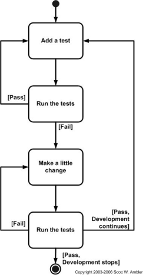

# This lesson covers the concepts of Test Driven Devlopment (TDD)

## Type of testing
* Unit testing
* TDD

### Python has several modules that we can use to test our code
* pytest
* unittest

***Why TDD***
* TDD helps us minimise the risk of failure before sending the product to production



***steps***
* we will create a file to write our tests
* we will run the test, they will all fail
* we will create a file to write our code
* we will refactor and add the code to pass the test

```
# This file will have our tests written

from simple_calc import Simple_Calc
import unittest
import pytest

# Lets create a class to write our tests

class Calctest(unittest.TestCase):
# unittest.TestCase works with unittest frame work as a parent class

    calc = Simple_Calc()
# creating an object of our class

# IMPORTANT - we MUST use test word in our functions so python interpreter knows what are we testing

    def test_add(self):
# self.assertEqual(self.calc.add(2, 4), 6)
        self.assertEqual(self.calc.add(2, 4), 6)
# what are we asking python to test for us
# we are asking python to test for us
# we are asking python to test/check if 2 + 4 = 6. If True, pass the test if False fail the test

    def test_subtract(self):
        self.assertEqual(self.calc.subtract(4, 2), 2) # Boolean
        # Test if 2 * 2 = 4 if True pass the test if False fail the test

    def test_multiply(self):
        self.assertEqual(self.calc.multiply(2, 2), 4)

    def test_divide(self):
        self.assertEqual(self.calc.divide(10, 5), 2)
```

**Naming convention for test files and methods**
* file name simple_calc
* test_simple_calc

**install the testing frameworks**
* ```pip install pytest```
## The TDD Cycle
* Write a failing test
* Make the test pass
* Refractor